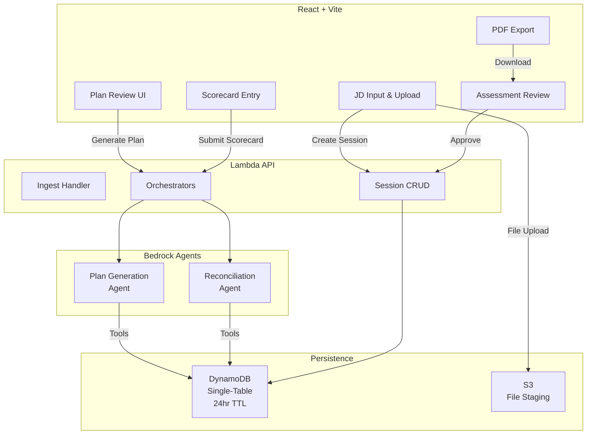

# interview-forge

A production-grade, human-in-the-loop AI agent platform demonstrating how to augment high-stakes hiring decisions with structured AI assistance while maintaining recruiter accountability at critical checkpoints.

## Overview

**interview-forge** transforms job descriptions into structured interview plans using AI agents, captures candidate responses via scorecards, and reconciles quantitative ratings with qualitative notes to produce final hiring assessments. The system enforces two explicit human approval gates — plan review before the interview, and assessment review after — ensuring AI accelerates decision-making without removing human judgment.

Built on **AWS Bedrock Agents**, **React**, and a **TypeScript monorepo**, this project demonstrates:

- AWS-native managed agent architecture with tool orchestration and session management
- Human-in-the-loop AI patterns suitable for regulated hiring workflows
- DynamoDB single-table design supporting realistic one-to-many access patterns
- End-to-end type safety with Zod schema validation across frontend, backend, and shared boundaries

## Quick Start

### Prerequisites

- Node.js 24.16.0+
- npm 10.5.0+
- AWS credentials configured (for CDK deployments)

### Setup

```bash
# Install dependencies
npm install

# Run tests across all workspaces
npm test --workspaces

# Check code formatting and linting
npm run lint

# Build all workspaces
npm run build
```

### Development

```bash
# Start the React development server
npm run dev -w packages/web

# Run tests in watch mode (single workspace)
npm run test -w packages/web

# Deploy infrastructure (requires AWS credentials)
npm run cdk:deploy -w packages/infra
```

## Architecture



## Project Structure

```
packages/
  ├── web/              # React 19 frontend (Vite, TailwindCSS, shadcn/ui)
  │   └── src/
  │       ├── common/   # Global components, hooks, utilities, theme
  │       └── pages/    # Feature-scoped pages and layouts
  │
  ├── api/              # Lambda handlers (Node.js ES modules)
  │   └── src/
  │       ├── handlers/ # HTTP entry points
  │       └── utils/    # AWS clients, logging, validation, responses
  │
  ├── infra/            # AWS CDK infrastructure (Lambda, DynamoDB, S3, Agent)
  │   └── src/
  │       └── stacks/   # Infrastructure definitions
  │
  └── shared/           # Zod schemas, TypeScript interfaces, utilities
      └── src/
          ├── models/   # Shared type definitions
          └── schemas/  # Validation schemas
```

## Key Features

- **Job Description Management**
  - Text paste or PDF/TXT file upload (parsed via `unpdf` in Lambda)
  - Reuse JD across multiple candidate sessions

- **AI-Driven Interview Planning**
  - Bedrock Agent generates competency areas and interview questions
  - Recruiter reviews and edits plan before interviews proceed
  - Approval checkpoint locks plan in DynamoDB

- **Structured Candidate Scoring**
  - Per-question Likert-scale ratings
  - Free-text competency-level notes
  - Flexible scorecard entry UI

- **Intelligent Assessment Reconciliation**
  - Bedrock Agent reconciles ratings and notes to identify agreement/conflict
  - Generates final hire/no-hire recommendation with reasoning
  - Approval checkpoint before persistence

- **PDF Report Export**
  - Client-side generation using `pdfmake` (no Lambda overhead)
  - Includes plan, scorecard, and final assessment

- **Candidate Session Persistence**
  - DynamoDB with 24-hour TTL auto-cleanup
  - Multiple candidate sessions per JD supported
  - GSI enables efficient querying

## Technology Stack

| Layer            | Technology                      | Purpose                                 |
| ---------------- | ------------------------------- | --------------------------------------- |
| Frontend         | React 19, Vite, TailwindCSS     | Modern component-driven UI              |
| Backend API      | AWS Lambda (Node.js ES modules) | Serverless compute                      |
| AI Orchestration | AWS Bedrock Agents              | Managed agent, tool orchestration, HITL |
| LLM              | Claude Sonnet 4.6 via Bedrock   | Plan generation and reconciliation      |
| Data Persistence | DynamoDB (single-table)         | Serverless, pay-per-request             |
| File Staging     | S3                              | JD upload storage with 24hr lifecycle   |
| PDF Parsing      | `unpdf` (Lambda bundled)        | Extract text from PDFs                  |
| Infrastructure   | AWS CDK (TypeScript)            | Infrastructure-as-Code                  |
| Validation       | Zod                             | Cross-boundary type safety              |
| Testing          | Vitest                          | Unit testing across all workspaces      |

## Development Workflow

### Code Standards

- **TypeScript:** Strict mode; prefer interfaces for structural types, types for unions/utilities
- **File Naming:** `kebab-case` for utilities/handlers, `camelCase` for React hooks, `PascalCase` for components
- **Co-location:** Unit tests live next to source files (`.test.ts`/`.test.tsx`)
- **No Barrel Files:** Import directly from source files for clarity and efficient bundling
- **Cross-Workspace Imports:** Use npm workspace symlinks (e.g., `import { TaskSchema } from "@interview-forge/shared"`) — never relative paths

### Testing

All workspaces use Vitest with 80% coverage minimum:

```bash
# Run tests in all workspaces
npm test --workspaces

# Run tests with coverage
npm run test:coverage --workspaces

# Run tests in specific workspace
npm run test -w packages/web
```

### Linting & Formatting

```bash
# Check code formatting and linting
npm run lint

# Auto-fix issues
npm run lint:fix

# Format code
npm run format
```

### Building

```bash
# Build all workspaces
npm run build

# Build specific workspace
npm run build -w packages/api
```

## Deployment

### Prerequisites

1. AWS Account with appropriate permissions
2. Environment variables configured (see `packages/infra/src/utils/config.ts`)
3. AWS credentials in `~/.aws/credentials` or via environment

### Deploy

```bash
# From repository root
npm run cdk:deploy -w packages/infra
```

### Destroy

```bash
npm run cdk:destroy -w packages/infra
```

### CI/CD

The repository includes three GitHub Actions workflows:

- **CI:** Format check, lint, build, unit tests, CDK synth (triggered on PR/push)
- **Deploy:** Manual workflow to provision and deploy all infrastructure
- **Teardown:** Manual workflow to destroy all infrastructure

## Workspace Commands

### Root-Level Commands

```bash
npm test --workspaces              # Run tests in all workspaces
npm run build --workspaces         # Build all workspaces
npm run lint                        # Lint entire monorepo
npm run format                      # Format entire monorepo
```

### Workspace-Scoped Commands

```bash
npm install <pkg> -w packages/web  # Add dependency to specific workspace
npm run dev -w packages/web        # Start web dev server
npm run test -w packages/api       # Test API workspace
npm run cdk:synth -w packages/infra # Synthesize CDK template
```

## Design Decisions

See [docs/PROJECT_OVERVIEW.md](docs/PROJECT_OVERVIEW.md) for detailed discussion of key architectural decisions including:

- Bedrock Agents vs. custom ReAct loops
- `unpdf` for PDF parsing vs. AWS Textract
- Shared JD records enabling multi-candidate sessions

## Contributing

This is a portfolio project. Feedback, suggestions, and discussions are welcome via GitHub issues.

## License

MIT
