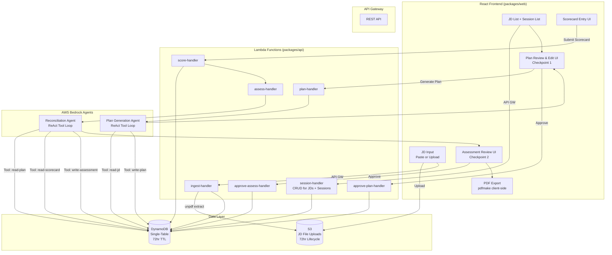
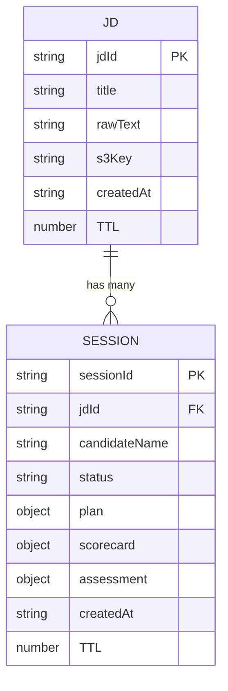

# Project Overview: interview-forge

**Version:** 1.0  
**Date:** 2026-06-02  
**Project Type:** Portfolio  
**Status:** Approved for Planning

---

## Executive Summary

`interview-forge` is a human-in-the-loop AI agent that transforms a job description into a structured, recruiter-reviewed interview plan — and then closes the loop by reconciling post-interview scorecards with free-text recruiter notes to produce a final candidate assessment. The agent handles the heavy lifting (question generation, competency mapping, scoring reconciliation) while the human recruiter retains approval authority at two explicit checkpoints: plan review before the interview, and assessment review after. The system supports multiple candidates per job description, enabling a recruiter to maintain a durable JD and run independent interview sessions for each candidate against a consistent evaluation framework. This project demonstrates the commercially dominant agentic pattern — AI that accelerates and augments human decision-making without removing human accountability from high-stakes hiring decisions.

---

## Goals

- **Primary Goal:** Demonstrate production-grade human-in-the-loop agent architecture using AWS Bedrock Agents, including explicit approval checkpoints, tool use, and structured output generation.
- **Secondary Goals:**
  - Show continuity with prior portfolio projects (`resume-lens`, `career-compass`, `talent-finder`) within the career/talent domain
  - Demonstrate multi-modal input ingestion (paste text + PDF/TXT upload via `unpdf`)
  - Demonstrate agent-driven structured output with Zod schema validation
  - Demonstrate reconciliation inference: agent resolving signal conflicts between structured ratings and free-text notes
  - Demonstrate a DynamoDB single-table design supporting a realistic one-to-many access pattern (JD → candidate sessions)

---

## Scope

### In Scope

- Job description ingestion via paste (raw text) or file upload (PDF or TXT); PDF parsed via `unpdf` in Lambda
- JD list view: browse all available JDs stored in DynamoDB and create new candidate sessions from any existing JD
- AI agent generation of a structured interview plan: competency areas, suggested questions per competency, evaluation criteria
- Recruiter review and edit UI: accept, modify, or regenerate sections of the plan before the interview (**Checkpoint 1**)
- Candidate session management: one interview session per candidate per JD, each with its own plan, scorecard, and assessment
- Post-interview scorecard: per-question structured ratings (Likert scale) plus free-text notes per competency area
- Agent reconciliation: synthesize ratings and free-text notes into a final candidate assessment with hire/no-hire recommendation and supporting reasoning
- Recruiter review and approval of final assessment before it is persisted (**Checkpoint 2**)
- Client-side PDF export of the final assessment report using `pdfmake` (runs in React, no Lambda involvement)
- DynamoDB persistence with a uniform 72-hour TTL applied to all records (JD metadata and all child session records share the TTL value set at JD creation time)
- Three GitHub Actions workflows: CI (format check, lint, build, unit tests, CDK synth), Deploy (manual, provisions and deploys all infrastructure), Teardown (manual, destroys all infrastructure)

### Out of Scope

- Calendar integration or interview scheduling
- Multi-user / team collaboration (single recruiter session only)
- Support for Word (.docx) document upload
- Candidate-facing interfaces or communication
- ATS (Applicant Tracking System) integration
- Authentication / user accounts (no login — consistent with prior portfolio projects)
- Multi-language support
- Assessment export to formats other than PDF
- TTL extension or reset — all records expire on a fixed 72-hour window from JD creation; no override mechanism

---

## Target Audience _(Portfolio)_

| Audience                                     | Signal Being Demonstrated                                                                                       |
| -------------------------------------------- | --------------------------------------------------------------------------------------------------------------- |
| Enterprise HR / talent platform clients      | Ability to design agentic AI workflows within legally defensible human-in-the-loop guardrails                   |
| Technical recruiters evaluating AI engineers | Mastery of Bedrock Agents tool use, approval flows, and structured output generation                            |
| AWS-focused engineering teams                | AWS-native agent architecture: Bedrock Agents, Lambda, DynamoDB, CDK, API Gateway                               |
| Solution design / pre-sales context          | Translating a complex multi-step business process (structured interviewing) into a feasible AI-augmented system |

---

## Technology Stack

| Layer               | Technology / Service                             | Rationale                                                                                                     |
| ------------------- | ------------------------------------------------ | ------------------------------------------------------------------------------------------------------------- |
| Frontend            | React 19, Vite, TailwindCSS, shadcn/ui           | Consistent with monorepo portfolio standard; supports drag-and-drop upload and multi-step workflow UI         |
| PDF Export          | `pdfmake` (client-side, React)                   | Bundles cleanly in the browser; no Lambda involvement; zero cold-start overhead                               |
| API                 | AWS Lambda (Node.js, ES Modules)                 | Serverless; consistent with portfolio pattern; cost-optimized at near-zero idle traffic                       |
| PDF Parsing         | `unpdf` (npm) bundled in Lambda                  | Synchronous; bundles and executes cleanly in Lambda ES module environment; confirmed working in `resume-lens` |
| Agent Orchestration | AWS Bedrock Agents                               | Native HITL support; built-in tool use and ReAct loop; session management; AWS-recommended managed agent tier |
| LLM                 | Claude Sonnet 4.6 via Bedrock                    | Best quality/cost balance for plan generation and reconciliation; $3.00/$15.00 per 1M tokens in/out           |
| Data                | DynamoDB (single-table design, on-demand)        | Serverless, zero idle cost; one-to-many JD → session access patterns via GSI; 72-hour TTL auto-expiry         |
| Storage             | S3                                               | JD file upload staging (PDF/TXT); 72-hour lifecycle policy aligned to DynamoDB TTL                            |
| Infrastructure      | AWS CDK (TypeScript)                             | IaC consistent with portfolio standard                                                                        |
| Monorepo            | npm workspaces (`web`, `api`, `shared`, `infra`) | Consistent with `technology-guidelines.md`                                                                    |
| Validation          | Zod (shared schemas)                             | Cross-boundary type safety; consistent with portfolio standard                                                |
| Testing             | Vitest (all workspaces)                          | Consistent with portfolio standard                                                                            |
| CI/CD               | GitHub Actions (3 workflows)                     | CI, Deploy (manual), Teardown (manual)                                                                        |

---

## Architecture Overview

The system is organized around two human approval checkpoints that explicitly gate agent progression. Between checkpoints, the Bedrock Agent autonomously executes tool calls to read context from DynamoDB, generate structured content, and write results back. All state — JD text, interview plan, scorecard, and final assessment — is persisted in DynamoDB throughout the session lifecycle.

**Workflow:**

1. Recruiter submits a JD (paste or upload) → Lambda extracts text (via `unpdf` for PDF) → JD record written to DynamoDB with 72-hour TTL
2. Recruiter selects a JD from the JD list and creates a new candidate session → session record written with the same TTL as the parent JD
3. Agent invoked for plan generation: calls tools to read the JD, generate competency areas and interview questions, write the draft plan to DynamoDB
4. **Checkpoint 1:** Recruiter reviews, edits, and approves the plan → plan locked in DynamoDB; interview proceeds offline
5. Recruiter returns post-interview, enters per-question Likert ratings and free-text notes per competency → scorecard written to DynamoDB
6. Agent invoked for reconciliation: reads plan and scorecard, identifies agreements and conflicts between ratings and notes, generates final assessment with hire/no-hire recommendation and reasoning → assessment written to DynamoDB
7. **Checkpoint 2:** Recruiter reviews and approves (or overrides) the final assessment → assessment locked in DynamoDB
8. Recruiter downloads the final assessment as a PDF (generated client-side via `pdfmake`)

### Architecture Diagram

---

## Key Design Decisions

### Decision: Bedrock Agents vs. Custom ReAct Loop

| Option                       | Pros                                                                                                                                            | Cons                                                                                                                                              |
| ---------------------------- | ----------------------------------------------------------------------------------------------------------------------------------------------- | ------------------------------------------------------------------------------------------------------------------------------------------------- |
| **Bedrock Agents**           | Native HITL support; built-in session management and tool orchestration; AWS-managed ReAct loop; strong portfolio signal for managed agent tier | Less fine-grained loop control; per-token cost amplification across multiple internal calls; some opacity in internal orchestration               |
| **Custom Lambda ReAct Loop** | Full control over prompt, loop, and state; cheaper at low token volumes; re-uses pattern already implicit in `talent-finder`                    | Requires custom session state management for HITL approval; re-implements what Bedrock Agents provides natively; weaker portfolio differentiation |

**Decision:** Bedrock Agents  
**Rationale:** The primary portfolio signal is the human-in-the-loop agent pattern. Bedrock Agents provides this natively and is the AWS-recommended managed tier. A custom loop was already demonstrated implicitly in `talent-finder`; this project advances to the managed agent abstraction. Cost amplification is acceptable at portfolio demo volumes (~$1–2/month).

---

### Decision: PDF Parsing — `unpdf` vs. AWS Textract

| Option                | Pros                                                                                                              | Cons                                                                                                     |
| --------------------- | ----------------------------------------------------------------------------------------------------------------- | -------------------------------------------------------------------------------------------------------- |
| **`unpdf` in Lambda** | Synchronous; zero additional AWS cost; confirmed working in `resume-lens`; bundles cleanly as ES module in Lambda | May not handle scanned or image-only PDFs; limited layout fidelity for complex documents                 |
| **AWS Textract**      | Handles scanned and complex-layout PDFs; managed service; high fidelity                                           | Async job model adds latency and state management complexity; per-page cost; overkill for text-heavy JDs |

**Decision:** `unpdf` in Lambda  
**Rationale:** JDs are universally text-heavy, machine-generated PDFs. `unpdf` is proven in `resume-lens` and has zero incremental AWS cost. Textract's async complexity and per-page cost are not justified for this input type.

---

### Decision: Multi-Candidate per JD — Shared JD Record vs. JD Duplication

| Option                                        | Pros                                                                                                                                 | Cons                                                                                 |
| --------------------------------------------- | ------------------------------------------------------------------------------------------------------------------------------------ | ------------------------------------------------------------------------------------ |
| **Shared JD record, sessions as children**    | Single source of truth for JD; key design is more interesting and realistic; enables JD reuse across candidates without re-ingestion | Slightly more complex single-table key design; requires GSI for session list queries |
| **Flat sessions (JD duplicated per session)** | Simpler data model; no GSI needed                                                                                                    | Redundant storage; no JD reuse; weaker data model story for portfolio                |

**Decision:** Shared JD record with sessions as children  
**Rationale:** More defensible production design. The one-to-many relationship makes the DynamoDB key design demonstrably more interesting. The additional GSI is negligible cost on DynamoDB on-demand pricing.

---

### Decision: PDF Assessment Export — Client-Side vs. Lambda

| Option                             | Pros                                                                                             | Cons                                                                                   |
| ---------------------------------- | ------------------------------------------------------------------------------------------------ | -------------------------------------------------------------------------------------- |
| **Client-side `pdfmake` in React** | Zero Lambda invocation cost; no cold-start latency; simpler architecture; no S3 staging required | PDF generation capability tied to browser environment; cannot be triggered server-side |
| **`pdfmake` in Lambda**            | Server-side generation enables future automation; consistent output regardless of client         | Additional Lambda complexity; cold-start overhead; requires S3 staging for download    |

**Decision:** Client-side `pdfmake` in React  
**Rationale:** Assessment export is always recruiter-triggered from the UI. Server-side generation adds complexity with no practical benefit at portfolio scope.

---

### Decision: DynamoDB TTL Strategy — Uniform vs. Per-Record

| Option                                                                    | Pros                                                                                                                                                | Cons                                                                                                                                             |
| ------------------------------------------------------------------------- | --------------------------------------------------------------------------------------------------------------------------------------------------- | ------------------------------------------------------------------------------------------------------------------------------------------------ |
| **Uniform TTL: JD TTL stamped onto all child sessions**                   | Single TTL value computed once at JD creation; no per-session TTL management; all related records expire together; simplest possible implementation | Sessions created late in a JD's TTL window will have a shorter effective lifetime than 72 hours from their own creation                          |
| **Per-record TTL: each record gets its own 72-hour window from creation** | Each session always lives for a full 72 hours from its creation                                                                                     | TTL values diverge across records; JD metadata may expire before child sessions; requires TTL enforcement logic to account for orphaned sessions |

**Decision:** Uniform TTL — JD TTL value stamped onto all child session records at creation  
**Rationale:** Simplest implementation with no orphan risk. All records related to a JD expire together. The edge case (a session created near a JD's TTL boundary expiring sooner than 72 hours from its own creation) is acceptable at portfolio scope with no auth or ownership model.

---

## DynamoDB Data Model

### Design Principles

- Single-table design with composite keys (`PK` / `SK`)
- All items carry a `TTL` attribute (Unix timestamp) set to the JD's creation time + 72 hours; this value is computed once at JD creation and propagated to all child session records
- A single GSI (`GSI1`) enables all required query access patterns without table scans

### Entity Definitions

#### JD (Job Description)

| Attribute   | Type    | Value                                     | Notes                                                    |
| ----------- | ------- | ----------------------------------------- | -------------------------------------------------------- |
| `PK`        | String  | `JD#{jdId}`                               | Partition key                                            |
| `SK`        | String  | `METADATA`                                | Sort key                                                 |
| `GSI1PK`    | String  | `JDS`                                     | Constant — enables listing all JDs via GSI1              |
| `GSI1SK`    | String  | `{createdAt}#{jdId}`                      | ISO timestamp prefix enables sort-by-date                |
| `jdId`      | String  | UUID                                      |                                                          |
| `title`     | String  | Recruiter-provided job title              |                                                          |
| `rawText`   | String  | Extracted JD text (from paste or `unpdf`) |                                                          |
| `s3Key`     | String? | S3 object key                             | Present only for file uploads                            |
| `createdAt` | String  | ISO 8601 timestamp                        |                                                          |
| `TTL`       | Number  | Unix timestamp                            | `createdAt` + 72 hours; propagated to all child sessions |

#### Session (one per candidate per JD)

| Attribute       | Type   | Value                             | Notes                                                                     |
| --------------- | ------ | --------------------------------- | ------------------------------------------------------------------------- |
| `PK`            | String | `JD#{jdId}`                       | Same partition as parent JD — co-located                                  |
| `SK`            | String | `SESSION#{sessionId}`             | Sort key                                                                  |
| `GSI1PK`        | String | `JD#{jdId}`                       | Enables listing all sessions for a JD via GSI1                            |
| `GSI1SK`        | String | `SESSION#{createdAt}#{sessionId}` | Sort-by-date within a JD's sessions                                       |
| `sessionId`     | String | UUID                              |                                                                           |
| `jdId`          | String | UUID                              | Denormalized for convenience                                              |
| `candidateName` | String | Recruiter-entered label           |                                                                           |
| `status`        | String | Enum                              | `PLAN_PENDING` \| `PLAN_APPROVED` \| `SCORED` \| `ASSESSED` \| `COMPLETE` |
| `plan`          | Map?   | Structured interview plan         | Written after Checkpoint 1 approval                                       |
| `scorecard`     | Map?   | Structured ratings + notes        | Written after scorecard submission                                        |
| `assessment`    | Map?   | Final assessment + recommendation | Written after Checkpoint 2 approval                                       |
| `createdAt`     | String | ISO 8601 timestamp                |                                                                           |
| `TTL`           | Number | Unix timestamp                    | Copied from parent JD's TTL at session creation                           |

### Access Patterns

| Access Pattern                                       | Key Expression                                            | Index |
| ---------------------------------------------------- | --------------------------------------------------------- | ----- |
| List all JDs (sorted by date desc)                   | `GSI1PK = "JDS"`, sort on `GSI1SK` desc                   | GSI1  |
| Get a single JD                                      | `PK = "JD#{jdId}"`, `SK = "METADATA"`                     | Table |
| List all sessions for a JD (sorted by date)          | `GSI1PK = "JD#{jdId}"`, `GSI1SK` begins_with `"SESSION#"` | GSI1  |
| Get a single session                                 | `PK = "JD#{jdId}"`, `SK = "SESSION#{sessionId}"`          | Table |
| Write / update session (plan, scorecard, assessment) | `PK = "JD#{jdId}"`, `SK = "SESSION#{sessionId}"`          | Table |

### Entity Relationship

---

## Estimated Costs

> All estimates assume **portfolio demo usage**: 10–20 full workflow executions per month (end-to-end: JD ingestion → plan generation → scorecard → assessment). Rates are US East (N. Virginia), on-demand pricing as of June 2026.

### Token Cost Model

A single full workflow execution through Bedrock Agents involves multiple internal model calls across the ReAct loop. A realistic estimate per execution:

| Phase                                       | Est. Input Tokens | Est. Output Tokens | Notes                                                                                       |
| ------------------------------------------- | ----------------- | ------------------ | ------------------------------------------------------------------------------------------- |
| Plan Generation (agent loop, ~3 tool calls) | ~6,000            | ~2,000             | JD text + system prompt + tool schemas + tool results as context; structured plan as output |
| Reconciliation (agent loop, ~3 tool calls)  | ~8,000            | ~1,500             | Plan + scorecard + notes as context; assessment + recommendation as output                  |
| **Per execution total**                     | **~14,000**       | **~3,500**         |                                                                                             |

At Claude Sonnet 4.6 rates ($3.00 per 1M input tokens, $15.00 per 1M output tokens):

| Volume              | Input Cost | Output Cost | Total            |
| ------------------- | ---------- | ----------- | ---------------- |
| 1 execution         | $0.042     | $0.053      | **~$0.095**      |
| 10 executions/month | $0.42      | $0.53       | **~$0.95/month** |
| 20 executions/month | $0.84      | $1.05       | **~$1.89/month** |

> **Important:** Bedrock Agents act as cost multipliers — each user-initiated action may trigger multiple internal model calls, and every call is billed. The estimates above account for approximately 3 tool calls per agent invocation with full context passed on each. Real costs may run 20–30% higher depending on system prompt verbosity and plan length. Bedrock Agents do not charge a per-invocation fee; token amplification is the sole cost driver.

### Supporting AWS Services

| Service                  | Usage                                                                                       | Estimated Monthly Cost |
| ------------------------ | ------------------------------------------------------------------------------------------- | ---------------------- |
| **DynamoDB** (on-demand) | ~20 writes + ~60 reads per execution × 20 executions                                        | < $0.01                |
| **S3**                   | ~20 JD file uploads × ~50KB avg; 72hr lifecycle auto-delete                                 | < $0.01                |
| **Lambda**               | ~10 invocations per execution × 20 executions = 200/month; well within free tier (1M/month) | $0.00                  |
| **API Gateway**          | ~200 requests/month; well within free tier (1M/month, first 12 months)                      | $0.00                  |
| **CloudWatch Logs**      | Low-volume demo logging                                                                     | < $0.01                |

### Total Estimated Monthly Cost

| Scenario                     | Bedrock (LLM) | AWS Infrastructure | **Total**        |
| ---------------------------- | ------------- | ------------------ | ---------------- |
| Light use (10 executions)    | ~$0.95        | ~$0.02             | **~$1.00/month** |
| Active demo (20 executions)  | ~$1.89        | ~$0.02             | **~$2.00/month** |
| Stress test (100 executions) | ~$9.50        | ~$0.10             | **~$9.60/month** |

**Bottom line:** At portfolio demo volumes this project runs for approximately **$1–2/month**. The dominant cost is LLM token usage via Bedrock Agents. All other AWS services are effectively free at this scale.

> **Cost optimization levers available if needed:**
>
> - Switch plan generation to Claude Haiku 4.5 ($1.00/$5.00 per 1M tokens) — reduces LLM cost by ~67% at the expense of output quality
> - Enable prompt caching on the system prompt (5-minute TTL) — up to 90% reduction on cached input tokens for repeated executions within the cache window
> - Batch API (50% discount) — not applicable here since executions are interactive and synchronous

---

## Constraints

- **Time:** 3–4 weeks solo effort
- **Budget:** ~$1–2/month at demo volumes; acceptable for portfolio use
- **Team:** Solo
- **Existing Systems:** Monorepo structure per `technology-guidelines.md`; no auth system (session-based, consistent with prior portfolio projects); 72-hour TTL on all session data; no TTL extension mechanism

---

## Risks & Mitigations

| Risk                                                                                                                                   | Likelihood | Impact | Mitigation                                                                                                                                                        |
| -------------------------------------------------------------------------------------------------------------------------------------- | ---------- | ------ | ----------------------------------------------------------------------------------------------------------------------------------------------------------------- |
| Bedrock Agents HITL state management adds unexpected implementation complexity                                                         | Medium     | Medium | Timebox agent integration to M1; if Bedrock Agents proves too opaque for HITL checkpoint state, fall back to custom Lambda ReAct loop with explicit state machine |
| Reconciliation inference quality is poor (agent fails to meaningfully distinguish agreements from conflicts between ratings and notes) | Medium     | High   | Design system prompt with explicit conflict-detection instructions and few-shot examples; allocate a dedicated prompt iteration task in M2                        |
| Token amplification drives costs higher than estimated during active development and testing                                           | Low        | Low    | Add CloudWatch token usage logging from day one; cap `maxTokens` per agent invocation                                                                             |
| `unpdf` fails on edge-case JD PDFs (scanned, encrypted, or image-only)                                                                 | Low        | Low    | Validate during M1; document as a known limitation; advise paste fallback in UI error messaging                                                                   |
| Sessions created late in a JD's TTL window expire before a recruiter completes the full workflow                                       | Low        | Low    | 72-hour window is generous for the expected workflow duration; acceptable at portfolio scope                                                                      |

---

## Open Questions

None. All blocking questions resolved.

---

## Revision History

| Version | Date       | Changes                                                                                                                                                                                                                                         |
| ------- | ---------- | ----------------------------------------------------------------------------------------------------------------------------------------------------------------------------------------------------------------------------------------------- |
| Draft 1 | 2026-06-01 | Initial brainstorming draft                                                                                                                                                                                                                     |
| Draft 2 | 2026-06-02 | Resolved all Draft 1 open questions; added DynamoDB data model, Estimated Costs section, GitHub Actions CI/CD definitions, `unpdf` and `pdfmake` decisions, multi-candidate JD → session navigation                                             |
| 1.0     | 2026-06-02 | Finalized for planning; increased TTL from 24 to 72 hours; uniform TTL strategy formalized with trade-off table; TTL extension explicitly out of scope; JD list shows all available records with no status display; all open questions resolved |
