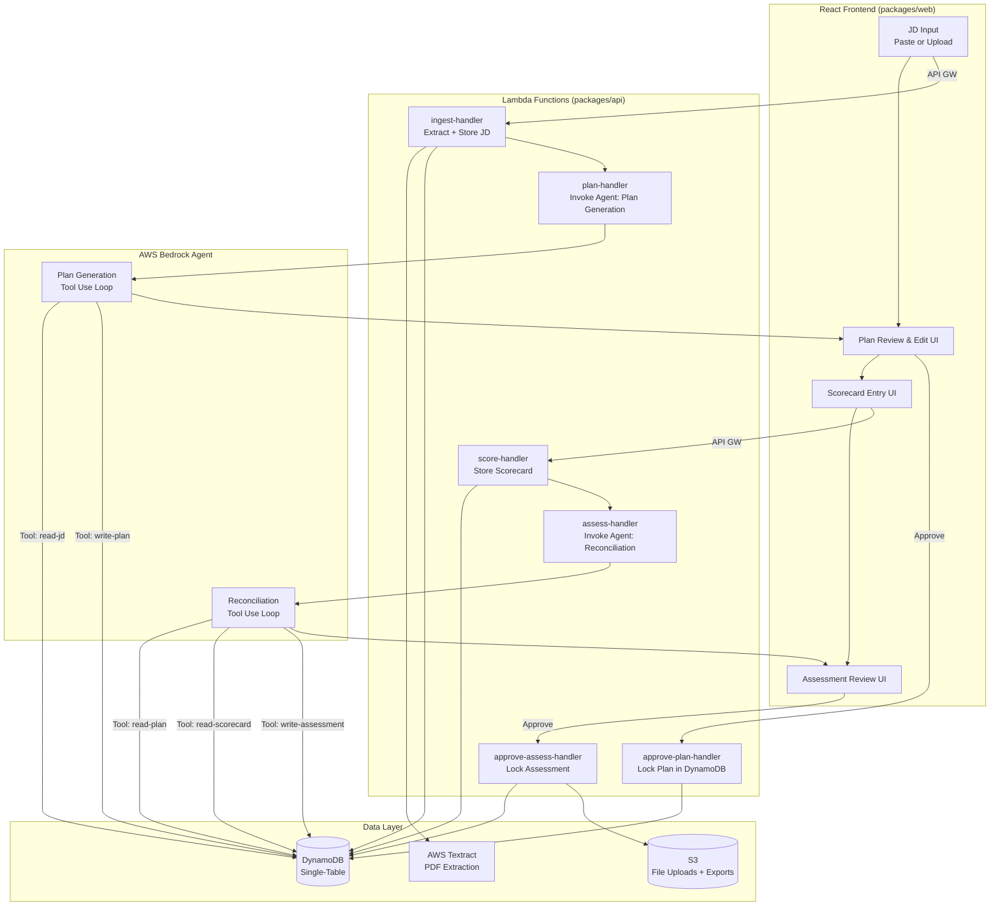

# Project Overview: interview-forge

**Version:** Draft 1  
**Date:** 2026-06-01  
**Project Type:** Portfolio  
**Status:** Brainstorming Draft

---

## Executive Summary

`interview-forge` is a human-in-the-loop AI agent that transforms a job description into a structured, recruiter-reviewed interview plan — and then closes the loop by reconciling post-interview scorecards with free-text recruiter notes to produce a final candidate assessment. The agent handles the heavy lifting (question generation, competency mapping, scoring reconciliation) while the human recruiter retains approval authority at two explicit checkpoints: plan review before the interview, and assessment review after. This project demonstrates the commercially dominant agentic pattern — AI that accelerates and augments human decision-making without removing human accountability from high-stakes hiring decisions.

---

## Goals

- **Primary Goal:** Demonstrate production-grade human-in-the-loop agent architecture using AWS Bedrock Agents, including explicit approval checkpoints, tool use, and structured output generation.
- **Secondary Goals:**
  - Show continuity with prior portfolio projects (`resume-lens`, `career-compass`, `talent-finder`) within the career/talent domain
  - Demonstrate multi-modal input ingestion (paste text + PDF/TXT upload)
  - Demonstrate agent-driven structured output with Zod schema validation
  - Demonstrate reconciliation inference: agent resolving signal conflicts between structured ratings and free-text notes

---

## Scope

### In Scope

- Job description ingestion via paste (raw text) or file upload (PDF or TXT)
- AI agent generation of a structured interview plan: competency areas, suggested questions per competency, evaluation criteria
- Recruiter review and edit UI: accept, modify, or regenerate sections of the plan before the interview
- Post-interview scorecard: per-question structured ratings (numeric or Likert scale) plus free-text notes per competency area
- Agent reconciliation: synthesize ratings + free-text notes into a final candidate assessment with hire/no-hire recommendation and reasoning
- Recruiter review of final assessment before it is saved/exported
- Persistence of sessions (JD → plan → scorecard → assessment) in DynamoDB
- Downloadable assessment report (PDF or structured JSON export)

### Out of Scope

- Calendar integration or interview scheduling
- Multi-user / team collaboration (single recruiter session only)
- Support for Word (.docx) document upload
- Candidate-facing interfaces or communication
- ATS (Applicant Tracking System) integration
- Authentication / user accounts (single-session, no login — consistent with prior portfolio projects)
- Multi-language support

---

## Target Audience _(Portfolio)_

| Audience                                     | Signal Being Demonstrated                                                                                        |
| -------------------------------------------- | ---------------------------------------------------------------------------------------------------------------- |
| Enterprise HR / talent platform clients      | Ability to design agentic AI workflows within legally defensible human-in-the-loop guardrails                    |
| Technical recruiters evaluating AI engineers | Mastery of Bedrock Agents tool use, approval flows, and structured output generation                             |
| AWS-focused engineering teams                | AWS-native agent architecture: Bedrock Agents, Lambda, DynamoDB, CDK, API Gateway                                |
| Solution design / pre-sales context          | Translating a complex, multi-step business process (structured interviewing) into a feasible AI-augmented system |

---

## Technology Stack

| Layer               | Technology / Service                             | Rationale                                                                                  |
| ------------------- | ------------------------------------------------ | ------------------------------------------------------------------------------------------ |
| Frontend            | React 19, Vite, TailwindCSS, shadcn/ui           | Consistent with monorepo portfolio standard; drag-and-drop upload + multi-step workflow UI |
| API                 | AWS Lambda (Node.js, ES Modules)                 | Serverless; consistent with portfolio pattern; cost-optimized at low/zero traffic          |
| Agent Orchestration | AWS Bedrock Agents                               | Native AWS HITL agent pattern; built-in tool use, ReAct loop, session management           |
| LLM                 | Claude Sonnet on Bedrock                         | Quality/cost balance for plan generation and reconciliation inference                      |
| Document Parsing    | AWS Textract (PDF) / inline text (TXT/paste)     | Managed extraction; avoids self-hosting parsers                                            |
| Data                | DynamoDB (single-table design)                   | Serverless, cost-optimized; session/plan/scorecard persistence                             |
| Storage             | S3                                               | JD file upload staging; assessment report export                                           |
| Infrastructure      | AWS CDK (TypeScript)                             | IaC consistent with portfolio standard                                                     |
| Monorepo            | npm workspaces (`web`, `api`, `shared`, `infra`) | Consistent with `technology-guidelines` constraints                                        |
| Validation          | Zod (shared schemas)                             | Cross-boundary type safety; consistent with portfolio standard                             |
| Testing             | Vitest (all workspaces)                          | Consistent with portfolio standard                                                         |
| CI/CD               | GitHub Actions                                   | [TBD — to be refined in Elaboration]                                                       |

---

## Architecture Overview

> The system is structured around two human approval checkpoints that gate agent progression. Between checkpoints, the Bedrock Agent autonomously executes tool calls to extract, generate, and reconcile content.

**Flow:**

1. Recruiter submits JD (paste or file upload) → Lambda extracts/preprocesses text → stored in DynamoDB
2. Agent invoked: calls tools to parse competencies, generate question bank, structure interview plan → returns draft plan
3. **Checkpoint 1**: Recruiter reviews, edits, and approves the plan → plan locked in DynamoDB
4. Recruiter conducts interview, then submits: per-question ratings (structured scorecard) + free-text notes per competency
5. Agent invoked: reconciles structured ratings vs. free-text notes, identifies agreements/conflicts, generates final candidate assessment with hire/no-hire recommendation
6. **Checkpoint 2**: Recruiter reviews and approves (or overrides) final assessment → saved and exportable

### Architecture Diagram

---

## Key Design Decisions

### Decision: Bedrock Agents vs. Custom ReAct Loop (Lambda + direct Bedrock InvokeModel)

| Option                       | Pros                                                                                                             | Cons                                                                                                                      |
| ---------------------------- | ---------------------------------------------------------------------------------------------------------------- | ------------------------------------------------------------------------------------------------------------------------- |
| **Bedrock Agents**           | Native HITL support; built-in session management; managed tool orchestration; no custom ReAct loop code          | Less fine-grained control over loop behavior; Bedrock Agents pricing adds per-token overhead; cold-start latency          |
| **Custom Lambda ReAct Loop** | Full control over prompt, loop, and state; cheaper at low token volumes; already demonstrated in `talent-finder` | More code to maintain; HITL approval requires custom session state management; re-implements what Bedrock Agents provides |

**Decision:** Bedrock Agents  
**Rationale:** The primary portfolio signal is demonstrating the HITL agent pattern — Bedrock Agents provides this natively and is the AWS-recommended approach. Custom ReAct loop was already demonstrated implicitly in `talent-finder`; this project should show the managed agent tier.

---

### Decision: PDF Parsing — Textract vs. Direct Lambda Extraction

| Option                          | Pros                                                                    | Cons                                                                                 |
| ------------------------------- | ----------------------------------------------------------------------- | ------------------------------------------------------------------------------------ |
| **AWS Textract**                | Managed; handles complex PDF layouts; no library dependencies in Lambda | Adds cost per page; async job model adds latency; overkill for simple text-heavy JDs |
| **pdf-parse / pdfjs in Lambda** | Synchronous; zero additional AWS cost; simpler code path                | Must bundle parser in Lambda; may fail on scanned or non-standard PDFs               |

**Decision:** [TBD — to be refined in Elaboration]  
**Rationale:** For JDs (typically clean, text-heavy PDFs), `pdf-parse` in Lambda may be sufficient and cheaper. Textract adds cost without proportional benefit for this use case. Needs confirmation.

---

## Constraints

- **Time:** 3–4 weeks solo effort
- **Budget:** Near-zero operational cost; Bedrock Agents token costs and DynamoDB on-demand pricing must stay within free-tier or minimal spend
- **Team:** Solo
- **Existing Systems:** Monorepo structure per `technology-guidelines.md`; no auth system (session-based, consistent with prior projects)

---

## Risks & Mitigations

| Risk                                                                                                | Likelihood | Impact | Mitigation                                                                                              |
| --------------------------------------------------------------------------------------------------- | ---------- | ------ | ------------------------------------------------------------------------------------------------------- |
| Bedrock Agents session management complexity adds unexpected scope                                  | Medium     | Medium | Timebox agent integration to M1; fall back to custom Lambda loop if Bedrock Agents proves too opaque    |
| Reconciliation inference quality is poor (agent fails to meaningfully synthesize ratings vs. notes) | Medium     | High   | Design prompt with explicit conflict-detection instructions; include few-shot examples in system prompt |
| Textract async model adds significant latency / complexity to JD ingestion                          | Low        | Medium | Default to synchronous `pdf-parse` in Lambda; Textract as optional upgrade path                         |
| Bedrock Agents pricing makes repeated demo use expensive                                            | Low        | Medium | Add token usage logging from day one; cap max tokens per agent invocation                               |

---

## Open Questions

- [ ] PDF parsing strategy: `pdf-parse` in Lambda vs. AWS Textract — confirm based on cost/complexity trade-off
- [ ] Bedrock Agents vs. custom ReAct loop — confirm Bedrock Agents is the right choice given portfolio signal goals
- [ ] Assessment export format: PDF report (requires PDF generation library) vs. structured JSON download — scope and complexity differ significantly
- [ ] GitHub Actions CI/CD pipeline: extent of automation (lint/test only vs. CDK deploy)
- [ ] DynamoDB session TTL: should sessions auto-expire? If so, what TTL window?

---

## Revision History

| Version | Date       | Changes                     |
| ------- | ---------- | --------------------------- |
| Draft 1 | 2026-06-01 | Initial brainstorming draft |
